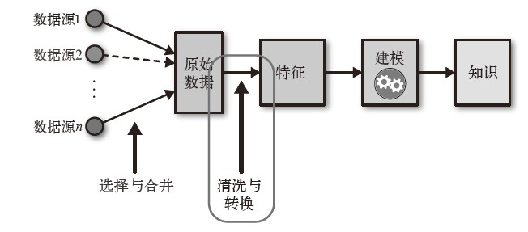
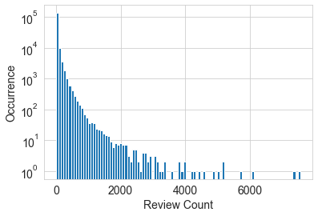
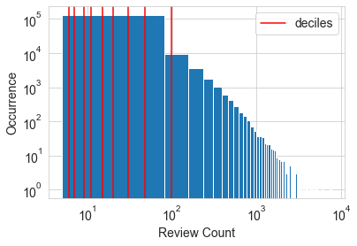
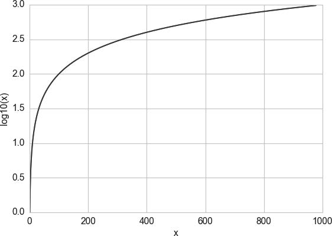
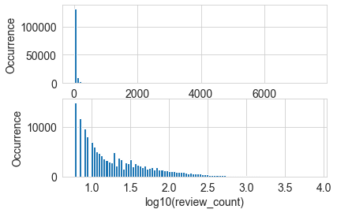
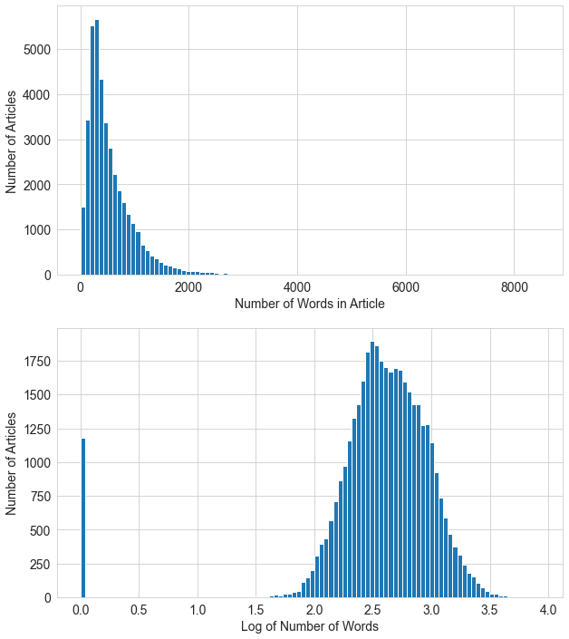

# feature-engineering-book

精通特征工程

## 第一章 机器学习流程

- 数据：对现实世界的现象的观测。

- 数学模型：描述了数据不同部分之间的关系。

- 特征：原始数据的数值表示。

- 特征工程：在给定数据、模型和任务的情况下设计出最合适的特征的过程。



## 第二章 简单而又奇妙的数值

好的特征不仅能够表示出数据的主要特点，还应该符合模型的假设，因此通常必须进行数据转换。

### 2.1 标量、向量和空间

单独的数值型特征称为标量，标量的有序列表称为向量，向量位于向量空间中。在绝大多数机器学习应用中，模型的输入通常表示为数值向量。

### 2.2 处理计数

大数据时代，数据可以大量且快速的生成，很有可能包含一些极端值。因此，需要检查数据的尺度，确定是应该保留数据原始的数值形式，还是应该将它们转换成二值数据，或者进行粗粒度的分箱操作。

#### 2.2.1 二值化

Echo Nest Taste Profile是百万歌曲数据集（Million Song Dataset）的正式用户数据子集，其中包含了100万用户在Echo Nest网站上完整的音乐收听历史。

数据集包括：

- 超过4800万个由用户ID、歌曲ID 和收听次数构成的三元组。

- 完整的数据集中包括1019318个独立用户和384546首独立歌曲。

根据对歌曲收听次数统计，收听次数并不能明显的反应用户对歌曲的喜爱程度，为了更强壮的用户偏好表示方法是将收听次数二值化，把所有大于1的次数值设为1。换言之，如果用户收听了某首歌曲至少一次，那么就认为该用户喜欢该歌曲。这样，模型就不用花费开销来预测原始收听次数之前的时间差别。二值目标变量是一个既简单又强壮的用户偏好衡量指标。

```python
    import pandas as pd
    listen_count = pd.read_csv('millionsong/train_triplets.txt.zip',
        header=None, delimiter='\t')
    # 表中包含有形式为“用户-歌曲-收听次数”的三元组。只包含非零收听次数。
    # 因此，要二值化收听次数，只需将整个收听次数列设为1。
    listen_count[2] = 1
```

### 2.2.2 区间量化（分箱）

数据源：Yelp 点评网站数据竞赛（http://www.yelp.com/dataset_challenge）第6 轮的数据。

数据信息：

- 782 个商业分类。

- 整个数据集包含1569264（≈160万）条点评和61184个商家。

- 就点评数量而言，“Restaurants”（990627条点评）和“Nightlife”（210028条点评）是最普遍的分类。

- 没有商家既属于餐馆又属于夜生活场所，所以这两个点评分组中没有重叠。

任务：使用协同过滤方法预测某用户给某商家的打分。而点评数量会是一个非常有用得输入特征，因为人气和高评分之间通常有很强的相关性。但是是否需要对原始点评数量数据进行加工呢？

首先对数据集本身进行分析：

```python
    # 例子2-2 Yelp数据集中的商家点评数量可视化
    import pandas as pd
    import json
    # 加载商户数据
    biz_file = open('yelp_academic_dataset_business.json')
    biz_df = pd.DataFrame([json.loads(x) for x in biz_file.readlines()])
    biz_file.close()

    import matplotlib.pyplot as plt
    import seaborn as sns
    # 绘制点评数量直方图
    sns.set_style('whitegrid')
    fig, ax = plt.subplots()
    biz_df['review_count'].hist(ax=ax, bins=100)
    ax.set_yscale('log')
    ax.tick_params(labelsize = 14)
    ax.set_xlabel('Review Count', fontsize = 14)
    ax.set_ylabel('Occurrence', fontsize = 14)
```



从直方图可以看出，原始点评数量横跨了若干个数量级，这对于很多模型而言都是个问题。在线性模型中，同一线性系数应该对所有可能的计数值起作用。过大的计数值对无监督学习方法也会造成破坏，比如k-均值聚类，它使用欧氏距离作为相似度函数来测量数据点之间的相似度。数据向量某个元素中过大的计数值对相似度的影响会远超其他元素，从而破坏整体的相似度测量。

一种解决方法是对计数值进行**区间量化**，然后使用量化后的结果。换言之，我们将点评数量分到多个箱子里面，去掉实际的计数值。区间量化可以将连续型数值映射为离散型数值，我们可以将这种离散型数值看作一种**有序的分箱序列**，它表示的是对密度的测量。

为了进行区间量化，必须确定每个分箱的宽度：固定宽度分箱和自适应分箱。

#### 1. 固定宽度分箱

通过固定宽度分箱，每个分箱中会包含一个具体范围内的数值，可以是线性的，也可以是指数性的。

```python
    # 例子2-3 通过固定宽度分箱对计数值进行区间量化
    import numpy as np
    # 生成20个随机整数，均匀分布在0~99之间
    small_counts = np.random.randint(0, 100, 20)
    small_counts
    >>> array([10, 80,  3, 81, 25, 71,  2, 66, 79, 21, 45, 61, 87, 70, 76, 72, 14, 33, 15, 39])

    # 通过除法映射到间隔均匀的分箱中，每个分箱的取值范围都是0~9
    np.floor_divide(small_counts, 10)
    >>> array([1, 8, 0, 8, 2, 7, 0, 6, 7, 2, 4, 6, 8, 7, 7, 7, 1, 3, 1, 3], dtype=int32)

    # 横跨若干数量级的计数值数组
    large_counts = [296, 8286, 64011, 80, 3, 725, 867, 2215, 7689,  11495, 91897, 44, 28, 7971, 926, 122, 22222]
    # 通过对数函数映射到指数宽度分箱
    np.floor(np.log10(large_counts))
    >>> array([2., 3., 4., 1., 0., 2., 2., 3., 3., 4., 4., 1., 1., 3., 2., 2., 4.])
```

#### 2. 分位数分箱

如果计数值中有比较大的缺口，就会产生很多没有任何数据的空箱子。因此，可以根据数据的分布特点，使用数据分布的分位数进行自适应的箱体定位。

**分位数**是可以将数据划分为相等的若干份数的值。

```python
     # 例2-4 计算Yelp商家点评数量的十分位数
    deciles = biz_df['review_count'].quantile([.1, .2, .3, .4, .5, .6, .7, .8, .9])
    deciles
    >>> 0.1     6.0
    0.2     7.0
    0.3     9.0
    0.4    11.0
    0.5    15.0
    0.6    20.0
    0.7    30.0
    0.8    48.0
    0.9    97.0
    Name: review_count, dtype: float64
    # 在直方图上画出十分位数
    sns.set_style('whitegrid')
    fig, ax = plt.subplots()
    biz_df['review_count'].hist(ax=ax, bins=100)
    for pos in deciles:
        handle = plt.axvline(pos, color='r')
    ax.legend([handle], ['deciles'], fontsize=14)
    ax.set_yscale('log')
    ax.set_xscale('log')
    ax.tick_params(labelsize = 14)
    ax.set_xlabel('Review Count', fontsize = 14)
    ax.set_ylabel('Occurrence', fontsize = 14)
```



要计算分位数并将数据映射到分位数分箱中， 可以使用Pandas 库， 如例2-5 所示。`pandas.DataFrame.quantile`和`pandas.Series.quantile`可以计算分位数。`pandas.qcut`可以将数据映射为所需的分位数值。

```python
    # 例2-5 通过分位数对计数值进行分箱
    pd.qcut(large_counts, 4, labels=False)
    >>> array([1, 2, 3, 0, 0, 1, 1, 2, 2, 3, 3, 0, 0, 2, 1, 0, 3], dtype=int64)

    # 计算实际的分位数值
    large_counts_series = pd.Series(large_counts)
    large_counts_series.quantile([0.25, 0.5, 0.75])
    >>>
    0.25     122.0
    0.50     926.0
    0.75    8286.0
    dtype: float64
```

## 2.3 对数变换

对数函数是指数函数的反函数，它的定义是$log_a(a^x) = x$，其中a是个正的常数，x可以是任意正数。因为$a^0 = 1$，所以有$log_a(1) = 0$。这意味着对数函数可以将(0, 1) 这个小区间中的数映射到(-∞, 0) 这个包括全部负数的大区间上。



通过上图可以看出，100-1000的x值被压缩至y轴的2-3部分；而小于100 的x值只占横轴的一小部分，但通过对数函数的映射，却占据了纵轴的剩余部分。

对于具有**重尾分布的正数值**的处理，对数变换是一个非常强大的工具。它压缩了分布高端的长尾，使之成为较短的尾部，并将低端扩展为更长的头部。

```python
    # 例2-6 对数变换前后的点评数量分布可视化

    log_review_count = np.log10(biz_df['review_count'] + 1)
    plt.figure()
    ax = plt.subplot(2,1,1)
    biz_df['review_count'].hist(ax=ax, bins=100)
    ax.tick_params(labelsize = 14)
    ax.set_xlabel('review_count', fontsize = 14)
    ax.set_ylabel('Occurrence', fontsize = 14)

    ax = plt.subplot(2,1,2)
    log_review_count.hist(ax=ax, bins=100)
    ax.tick_params(labelsize = 14)
    ax.set_xlabel('log10(review_count)', fontsize = 14)
    ax.set_ylabel('Occurrence', fontsize = 14)
```



通过上图对比发现，两幅图中的y轴都是正常（线性）标度，在下方的图形中，区间(0.5, 1]中的箱体间隔很大，是因为在1和10之间只有10个可能的整数计数值。请注意，初始的点评数量严重集中在低计数值区域，但有些异常值跑到了4000之外。经过对数变换之后，直方图在低计数值的集中趋势被减弱了，在x轴上的分布更均匀了一些。

例2-7，数据来自加州大学欧文分校机器学习库的在线新闻流行度数据集，目标是使用这些特征来预测文章的流行度，流行度用社交媒体上的分享数表示。本案例中，重点关注“文章中的单词个数“特征，可以看出这个特征在经过对数变换后，直方图更像高斯分布了。

```python
    # 例2-7 新闻文章流行度分布的可视化，使用对数变换和不使用对数变换
    news_df = pd.read_csv('OnlineNewsPopularity.csv', delimiter=', ')
    news_df.head()
    news_df['log_n_tokens_content'] = np.log10(news_df['n_tokens_content'] + 1)
    plt.figure(figsize=(10, 12))
    ax = plt.subplot(2, 1, 1)
    news_df['n_tokens_content'].hist(ax=ax, bins=100)
    ax.tick_params(labelsize=14)
    ax.set_xlabel('Number of Words in Article', fontsize=14)
    ax.set_ylabel('Number of Articles', fontsize=14)

    ax = plt.subplot(2, 1, 2)
    news_df['log_n_tokens_content'].hist(ax=ax, bins=100)
    ax.tick_params(labelsize=14)
    ax.set_xlabel('Log of Number of Words', fontsize=14)
    ax.set_ylabel('Number of Articles', fontsize=14)
```



### 2.3.1 对数变换实战